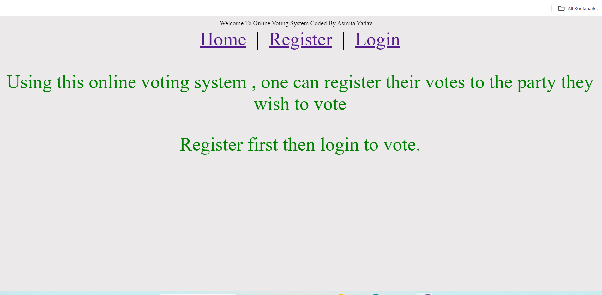
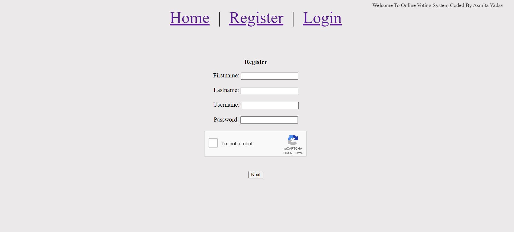
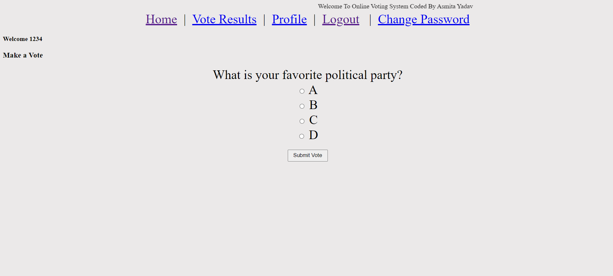
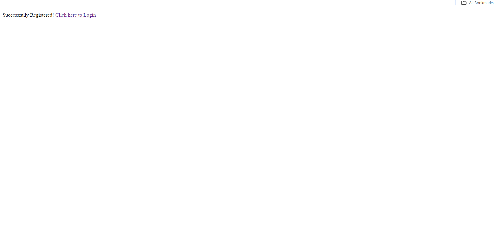
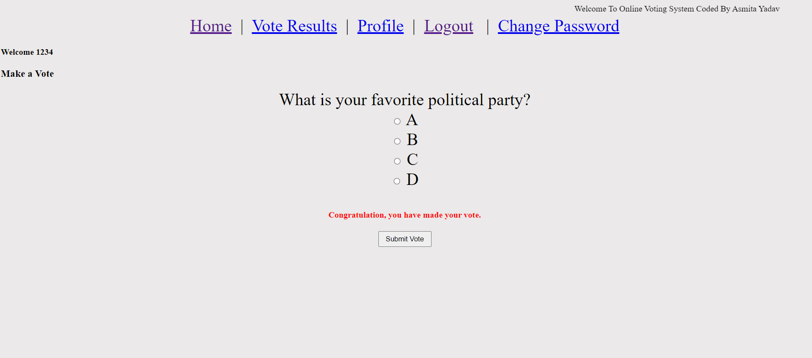

Brief overview of the technology:
Front end: HTML, CSS, JavaScript

 HTML: HTML is used to create and save web document. E.g. Notepad/Notepad++  
 CSS : (Cascading Style Sheets) Create attractive Layout 
 Bootstrap : responsive design mobile freindly site 
 JavaScript: it is a programming language, commonly use with web browsers. 
 Back end: PHP, MySQL 

 PHP: Hypertext Preprocessor (PHP) is a technology that allows software developers to create dynamically generated web pages, in HTML, XML, or other document types, as per client request. PHP is open source software. 
 MySQL: MySql is a database, widely used for accessing querying, updating, and managing data in databases. 

  Images of project are given below 

Home Page:

  

Register Page:

  

Login Page:

  

Successful Login Page:

  

Successful voted page:

  

 
  

